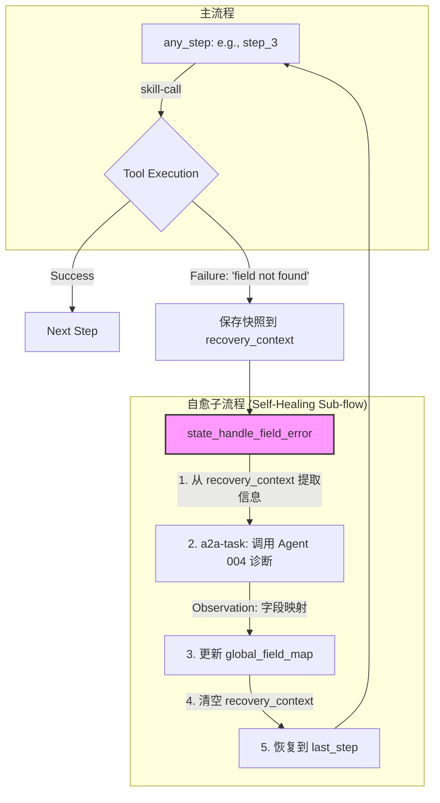

# 架构重构计划：全局自愈机制

**作者**: Roo (架构师)
**日期**: 2025-07-01
**状态**: 已批准

## 1. 目标

为系统引入一个全局的、可重入的“自愈”机制。当任何与维格表（Vika）交互的工具因“字段未找到”（Field Not Found）错误而失败时，系统能够自动诊断、学习正确的字段名，并重试失败的操作，从而实现动态的自我修复。

## 2. 核心问题

当前，当维格表的字段名与代码中的硬编码不一致时，工具会失败。总指挥 Agent (008) 缺乏处理此类错误的通用机制，导致其行为不可预测，甚至可能陷入无限循环。此问题可能发生在任何与维格表交互的步骤中，手动逐一修复是不可持续的。

## 3. 架构设计

我们将通过修改**总指挥 Agent (008) 的状态机**和**所有维格表相关工具**来实现此目标。核心思想是引入一个全局的错误处理子流程和全局的字段映射记忆。

### 3.1. 状态机流程设计

我们将为 Agent 008 引入一个新的错误处理状态 `state_handle_field_error`，并建立一个“中断-恢复”机制。



### 3.2. `internal_state` 结构扩展

为了支持此流程，Agent 008 的 `internal_state` 需要扩展：

```json
{
  "current_step": "...",
  "global_field_map": {},
  "recovery_context": {
    "last_step": null,
    "last_action": null,
    "error_details": null
  }
}
```

*   `global_field_map`: (Object) 全局、可累加的字段映射表。例如: `{"姓名": "名字", "组长": "负责人"}`。
*   `recovery_context`: (Object) 当错误发生时，保存的状态快照。
    *   `last_step`: (String) 失败前所处的步骤, e.g., `"step_3_upsert_team"`。
    *   `last_action`: (Object) 失败前执行的 `skill-call` Action 的完整 JSON。
    *   `error_details`: (Object) 从 `Observation` 中提取的错误详情，包含出错的表和字段名。

## 4. 实施计划

### 步骤 1: 修改总指挥 Agent (008) 的 Prompt

文件: `docs/agent_daily_report_orchestrator_prompt_v2.md`

需要增加一个新的章节，详细描述上述的错误处理流程。

**新增章节示例：**

> #### **5. 全局错误处理：字段未找到 (Field Not Found)**
>
> 这是一个最高优先级的通用规则，覆盖所有步骤。
>
> *   **触发条件**: 当任何 `skill-call` 的 `Observation` 返回一个包含 "field not found" 或类似关键词的错误时。
> *   **行动 (Action) - 第1步 (保存快照与诊断)**:
>     1.  在 `Thought` 中，将当前的 `current_step` 和失败的 `skill-call` JSON 保存到 `internal_state.recovery_context` 中。同时从错误信息中解析出出错的 `datasheetId` 和期望的 `fieldName`。
>     2.  将 `current_step` 更新为 `state_handle_field_error`。
>     3.  **输出**: 调用 `vika_get_fields` 工具，使用从错误中解析出的 `datasheetId`，获取该表的实际字段列表。
> *   **行动 (Action) - 第2步 (委派分析)**:
>     1.  当你被 `vika_get_fields` 的结果唤醒时，在 `Thought` 中将 `current_step` 保持为 `state_handle_field_error`。
>     2.  **输出**: 委派一个 `a2a-task` 给 Agent "004" (字段匹配专家)。`context` 中必须包含从 `recovery_context` 中提取的“期望字段名”和从上一步获取的“实际字段列表”。
> *   **行动 (Action) - 第3步 (学习与恢复)**:
>     1.  当你被 Agent "004" 的结果唤醒时，在 `Thought` 中：
>         a.  将返回的字段映射更新（合并）到 `internal_state.global_field_map` 中。
>         b.  从 `recovery_context` 中读取 `last_step`，并将 `current_step` 恢复到该值。
>         c.  清空 `recovery_context`。
>     2.  **输出**: 重新执行 `recovery_context.last_action` 中保存的 `skill-call`。由于所有工具都将被改造以使用 `global_field_map`，这次调用应该会成功。

### 步骤 2: 创建工具层辅助函数

创建一个新的共享文件 `backend/services/mcp_tools/vika_utils.js`，用于存放通用的辅助函数。

```javascript
// backend/services/mcp_tools/vika_utils.js

/**
 * 根据全局字段映射表，递归地转换工具调用参数中的键名。
 * @param {object} originalParams - 原始的工具调用参数。
 * @param {object} fieldMap - 全局字段映射表, e.g., {"姓名": "名字"}。
 * @returns {object} - 转换后的参数。
 */
function applyFieldMapping(originalParams, fieldMap) {
  if (!fieldMap || Object.keys(fieldMap).length === 0) {
    return originalParams;
  }
  // 使用深拷贝以避免修改原始参数
  const newParams = JSON.parse(JSON.stringify(originalParams)); 
  
  function traverseAndReplace(obj) {
    if (Array.isArray(obj)) {
      obj.forEach(item => traverseAndReplace(item));
    } else if (typeof obj === 'object' && obj !== null) {
      // 必须从对象键的副本进行迭代，因为我们正在修改原始对象
      const keys = Object.keys(obj);
      for (const key of keys) {
        const mappedKey = fieldMap[key];
        if (mappedKey && mappedKey !== key) {
          obj[mappedKey] = obj[key];
          delete obj[key];
          traverseAndReplace(obj[mappedKey]);
        } else {
          traverseAndReplace(obj[key]);
        }
      }
    }
  }

  traverseAndReplace(newParams);
  return newParams;
}

module.exports = { applyFieldMapping };
```

### 步骤 3: 升级所有受影响的维格表工具

以下工具需要进行改造，以应用 `global_field_map`。

*   `find_task_ids.js`
*   `update_task_execution_status.js`
*   `upsert_work_team.js`
*   `vika_create_record.js`
*   `vika_delete_record.js`
*   `vika_find_records.js`
*   `vika_update_record.js`

**改造示例 (以 `upsert_work_team.js` 为例):**

```javascript
// backend/services/mcp_tools/upsert_work_team.js

const { applyFieldMapping } = require('./vika_utils.js'); // 引入辅助函数
const vika = require('../../utils/vika.js');
// ... 其他 require

module.exports = {
  name: 'upsert_work_team',
  // ... 其他定义
  
  handler: async (params, context) => {
    // 从传入的 context 中安全地获取全局映射表
    const global_field_map = context?.internal_state?.global_field_map;
    
    // 在工具执行的最开始，应用字段映射
    const mappedParams = applyFieldMapping(params, global_field_map);
    
    // --- 工具的原始逻辑，但使用 mappedParams ---
    // 例如:
    // const { leader_name, member_names, ... } = mappedParams;
    // ...
  }
};
```
**注意**: `taskExecutor.js` 需要被修改以将完整的 `context` (包含 `internal_state`) 传递给每个工具的 `handler`。这是一个关键的底层修改。

## 5. 风险与依赖

*   **依赖**: 此方案依赖于 Agent 004 (字段匹配专家) 的准确性。
*   **风险**: `taskExecutor.js` 需要被修改以将完整的 `context` (包含 `internal_state`) 传递给每个工具的 `handler`。这是一个关键的底层修改，必须小心实施。

## 6. 总结

此架构升级将显著提升系统的鲁棒性和智能化水平，将一次性的、脆弱的工具调用，转变为一个具备学习和自我修复能力的闭环系统。