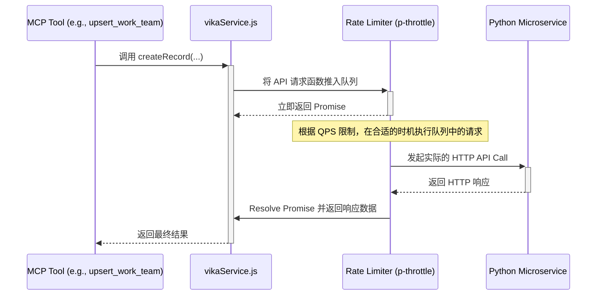

# 架构设计与重构计划：全局维格表 API 速率限制服务

## 1. 目标

建立一个健壮、集中化的维格表 API 调用服务 (`vikaService.js`)，内置一个基于队列的速率限制器。这将根除在各个工具中手动添加 `delay` 的不可靠做法，确保所有 API 请求严格遵守 QPS 限制，从而提高系统的稳定性和可维护性。

## 2. 核心问题分析

经过对现有代码的分析，我们发现：

*   **已存在中心化服务**：`backend/services/vikaService.js` 已经作为维格表调用的统一入口，这是一个非常好的基础。
*   **速率限制方式不可靠**：`vikaService.js` 内部以及各个调用它的工具（如 `upsert_work_team.js`）目前都使用 `await sleep(delay)` 的方式来限制速率。这种方式在高并发下是无效的，它只能保证两个请求之间有最小间隔，但无法防止在同一时刻有多个请求同时被唤醒并发出，从而超出 QPS 限制。
*   **逻辑分散**：限速逻辑散落在 `vikaService.js` 和多个 `mcp_tools` 文件中，导致代码冗余且难以维护。

## 3. 架构设计方案

我们的核心方案是改进 `vikaService.js`，用一个专业的速率限制库（如 `p-throttle`）来替换当前的 `sleep` 机制。

### 3.1. 技术选型

*   **速率限制库**: 我建议使用 `p-throttle`。
    *   **原因**: 它是一个轻量级、经过充分测试的库，专门用于解决此类问题。它能创建一个函数包装器，将所有通过它的调用放入一个队列中，并严格按照设定的速率（例如，每秒5次）来执行它们。这比我们自己手动实现一个基于 `Promise` 的队列要更简单、更可靠。

### 3.2. `vikaService.js` 改造

1.  **引入依赖**: 在 `backend` 目录下，需要添加 `p-throttle` 依赖。
2.  **初始化节流阀 (Throttler)**: 在 `VikaService` 的构造函数 `constructor()` 中，我们将移除 `this.apiDelay` 的计算，替换为初始化 `p-throttle`。

    ```javascript
    // 在文件顶部引入
    const pThrottle = require('p-throttle');

    class VikaService {
      constructor() {
        // ... 其他初始化代码 ...
        this.initThrottler();
        this.initService();
      }

      initThrottler() {
        const config = this.getConfig();
        const qps = config.rateLimitQPS || 2; // 默认为 2 QPS

        // 创建一个节流函数
        this.throttle = pThrottle({
            limit: qps,
            interval: 1000 // 1秒
        });

        // 将所有需要调用 Python 服务的核心逻辑包装起来
        this.throttledRequest = this.throttle(async (requestFn) => {
            return requestFn();
        });
      }
      // ...
    }
    ```

3.  **包装 API 调用**: 我们将修改 `vikaService.js` 中所有与维格表 API 交互的方法（如 `createRecord`, `getRecords` 等），移除 `await this.sleep(this.apiDelay)`，并使用我们创建的 `this.throttledRequest` 来包装实际的 `axios` 请求。

    *   **修改前**:
        ```javascript
        async createRecord(datasheetId, fields) {
          // ...
          await this.sleep(this.apiDelay);
          await this.ensureInitialized();
          const response = await this.apiClient.post('/records', { /* ... */ });
          // ...
        }
        ```

    *   **修改后**:
        ```javascript
        async createRecord(datasheetId, fields) {
          logger.info('正在向维格表创建记录', { datasheetId });
          try {
            await this.ensureInitialized();
            
            const response = await this.throttledRequest(() => 
                this.apiClient.post('/records', {
                    datasheet_id: datasheetId,
                    records: [{ fields }]
                })
            );
            
            const result = this.handleApiResponse(response, `创建记录: ${datasheetId}`);
            // ...
            return result;
          } catch (error) {
            // ...
          }
        }
        ```

### 3.3. 流程图

下面的 Mermaid 图清晰地展示了重构后的调用流程：



## 4. 详细重构计划

1.  **修改 `backend/services/vikaService.js`**:
    *   按照 **3.2** 中的描述，引入 `p-throttle`，在构造函数中初始化节流阀，并重构所有与 API 交互的方法，用节流阀包装请求并移除 `sleep`。

2.  **清理 MCP 工具**:
    *   遍历以下文件，移除所有手动的 `sleep` 或 `delay` 调用。这些工具的逻辑将变得更简洁，因为它们不再需要关心速率限制的实现细节。
    *   **文件列表**:
        *   `backend/services/mcp_tools/upsert_work_team.js`
        *   `backend/services/mcp_tools/vika_create_record.js`
        *   `backend/services/mcp_tools/vika_delete_record.js`
        *   `backend/services/mcp_tools/vika_find_records.js`
        *   `backend/services/mcp_tools/vika_get_fields.js`
        *   `backend/services/mcp_tools/vika_update_record.js`
        *   (可能) `backend/services/mcp_tools/find_task_ids.js`
        *   (可能) `backend/services/mcp_tools/update_task_execution_status.js`

## 5. 总结

该计划通过在 `vikaService.js` 中引入真正的速率限制队列，从根本上解决了 QPS 控制问题。它将限速逻辑集中到一处，简化了所有上层工具的代码，使整个系统更加健壮和易于维护。